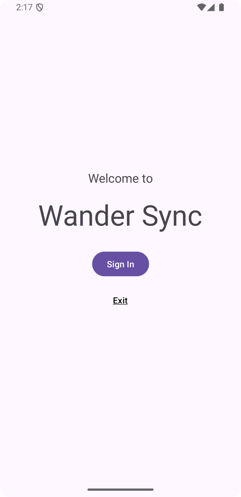
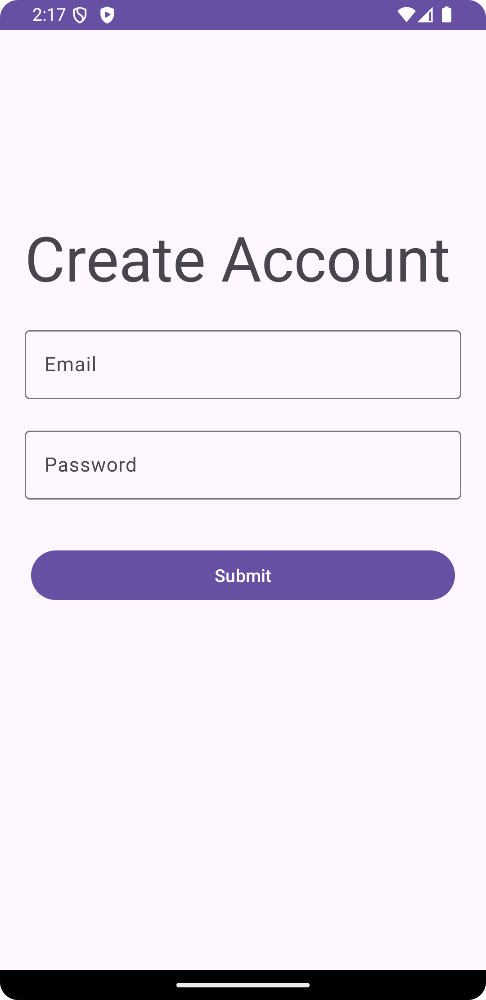
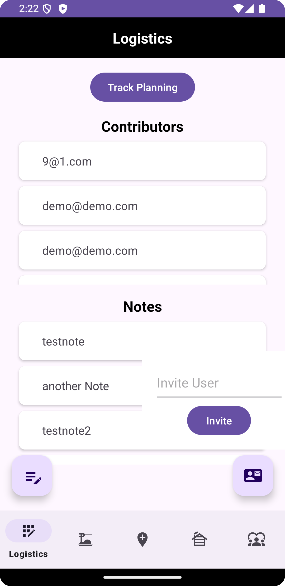
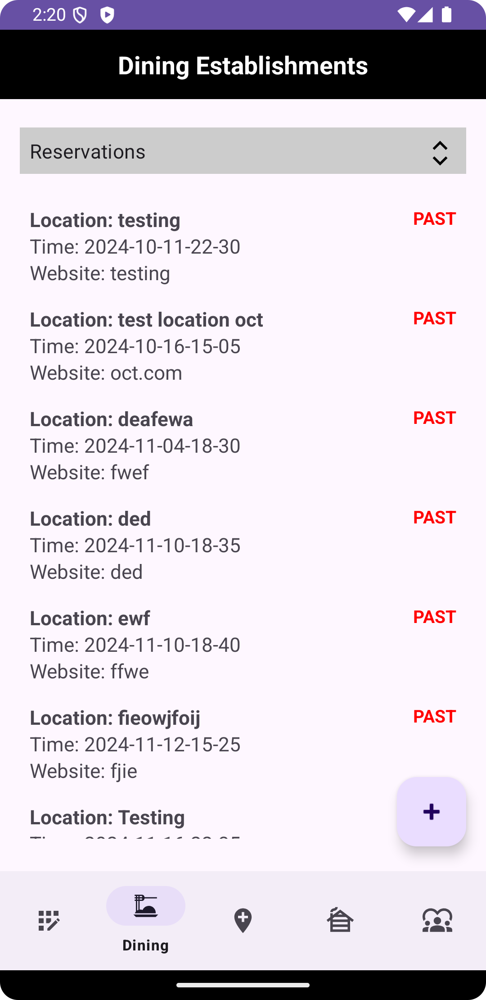
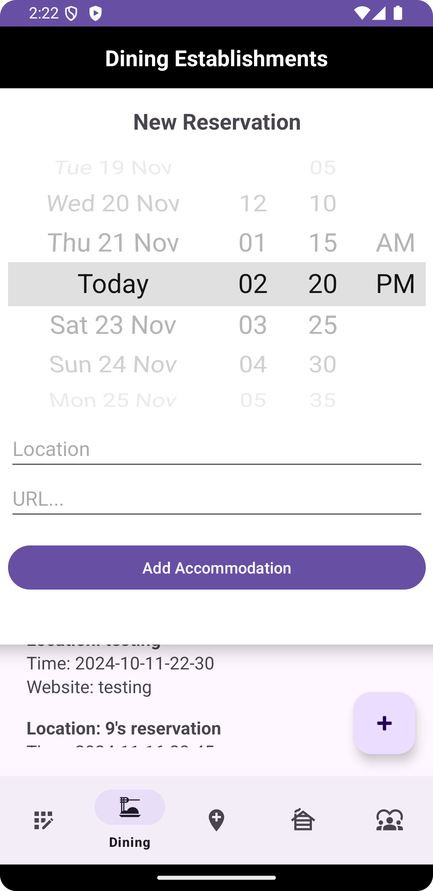
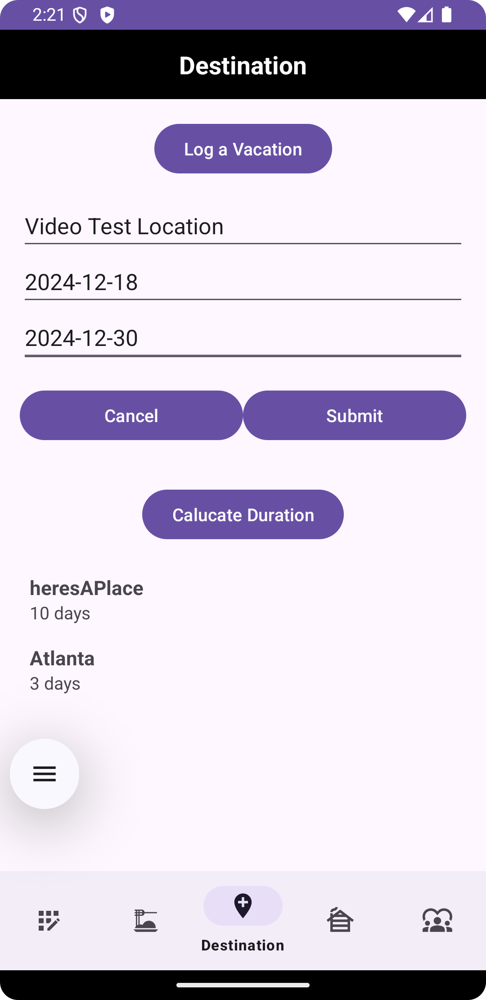
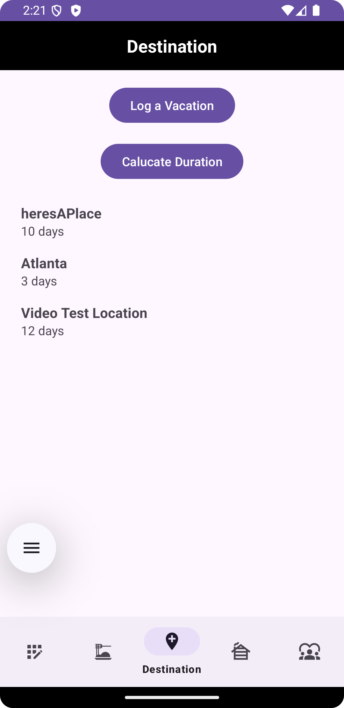
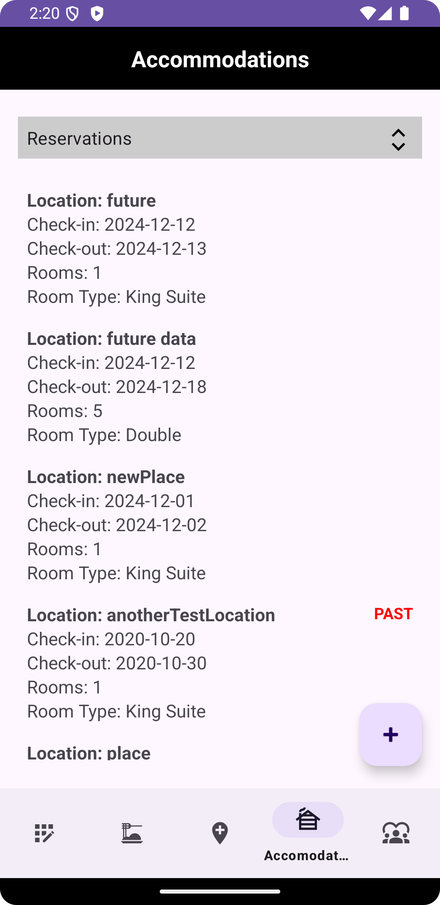

# CS2340C_Team13

## Introduction

Over the course of 4 Sprints, our team was tasked with developing WanderSync: A Collaborative Travel Management System application. WanderSync is simplifies the process of creating and managing travel itineraries for solo and group travel. Through this project, users can contribute to and refine travel plans in real-time. The Travel Management app allows users to organize locations, transportation options, accommodations, dining reservations, and personal notes. Secure account creation, an easy-to-use itinerary management interface, and real-time group planning collaboration tools are some of the main features. Travel information like destinations, transit times, hotel details, and food preferences can all be easily integrated by users. Additionally, the app allows users to create and share travel agendas, add and share notes, and synchronize updates across the entire group.

For our first sprint, we oversaw app implementation of a welcome screen, log in screen and its associated components (authentication, create new account, etc.) and basic layout structure of when a user enters the app. The completed work included a splash screen that encompassed the color scheme and theme of WanderSync, a welcome screen that introduces users to the app with the option to log in or quit, a log in screen that uses Firebase authentication to validate log in credentials, a create account screen that users can use to register their credentials in the app, and finally a blueprint of the actual application that has a navigation bar for 5 major screens. The framework is properly set up to make changes to each of the 5 screens and divide tasks into personal branches. 

For Sprint 2, the focus of the app was to start data logging and create a travel community, with a focus on the backend database and how it is managed (how classes interact with one another). For app functionality we have two screens, logistics and destination, completed to accomplish their respective tasks. We have a working backend that integrates with the text boxes/forms on the front-end. The logistics screen has a dynamically updating pie chart that a user can use to track how many vacation days they have left available to plan. Additionally, they have the option to invite other users to collaborate on their trips and start the collaboration aspect of the app. Once a user is a collaborator, all users’ notes are visible to each other and everyone can communicate online. 

For Sprint 3, the focus of the app was to develop 2 more key pages of our app, Dining and Accommodations. Both pages were similar in that the user had a form, fill out details, and then display an updated list of those reservations dynamically. These two pages used design pattern evidence, namely observer strategy, to listen for updates to both lists of reservations and update them as a user is inserting new reservations. Additionally, there is also an option for users to sort by past and present reservations which is also dynamically updated as the days go by.  

Finally, for Sprint 4, we created a travel community screen as well as creating and maintaining a travel community database. This was the final fragment in our navigation bar and wraps up the apps full functionalities. This page allows members of the travelling community to post about trips and see what other people are doing. There is also an option to add notes about the trip, add specific reservations and attach it to this trip, and more. 

## Design and Architecture

User flow interactions were best drawn up before implementation of the app to get a full understanding of the user functionality should actually occur. We have both Sequence Diagrams and Design Class Diagrams that we have developed as new features have been added to augment the understanding of our app. 

Below is the Sequence Diagram for the process of "Creating a New Travel Log."

> Image of SD

The use case is to allow a user to create a new travel log entry within the app. The user specifies details such as location, start date, end date, and duration of the trip. The application then generates a unique travel log entry associated with the user’s account and saves it in the database. This use case demonstrates the interactions involved in setting up, creating, and storing a new travel log entry in the system. 

Step-by-Step Interaction Description: 

1. User initiates the creation of a new travel log by providing details like location, start date, end date, and duration. 
2. DestinationViewModel receives these details from the user and calls addTravelLog() on DestinationDatabase. 
3. DestinationDatabase generates a unique ID for the travel log, instantiates a TravelLog object with the provided details, and stores it. 
4. The DestinationViewModel updates the User by associating this new travel log ID with the user’s trip details. 

ALT Fragment: An alternative flow that handles cases where saving the Travel Log to the database fails. 

Additionally, we have a finalized Design Class Diagram that illustrates the key classes, their attributes, and the relationships between them, providing a comprehensive overview of the system's architecture. It is organized into three primary layers: the Database Layer, which handles data persistence and retrieval through classes like AccommodationDatabase, DiningDatabase, and TripDatabase; the ViewModel Layer, which acts as an intermediary for data processing and communication between the database and UI through classes like AccommodationViewModel and DiningViewModel; and the Domain Layer, which encapsulates core entities such as Trip, User, and related reservations and travel logs. This diagram highlights the system's modular design and its adherence to the MVVM pattern for scalability and maintainability.

At the core of the architecture are multiple database classes (e.g., AccommodationDatabase, DiningDatabase, TripDatabase), each responsible for handling specific categories of data. These classes maintain references to the underlying database (databaseReference) and expose their data through observable attributes such as LiveData, enabling real-time updates to the UI.

The ViewModel classes (e.g., AccommodationViewModel, DiningViewModel) serve as intermediaries between the database classes and the user interface. They consolidate and process data, such as combining information from UserDatabase, TripDatabase, and the specific database classes they are associated with. For example, DiningViewModel retrieves dining reservations from DiningDatabase while cross-referencing user details from UserDatabase and trip-specific details from TripDatabase. The use of LiveData in these ViewModels ensures that changes in the database are reflected dynamically in the user interface, fostering an interactive and responsive user experience.

Central to the domain layer are the Trip and User classes, which encapsulate key relationships. A Trip instance aggregates reservations (diningReservations, accommodationReservations), travel logs, and contributor notes, while a User instance tracks associated trips and allocated vacation time. Supporting classes such as AccommodationReservation, DiningReservation, and TravelLog provide detailed, structured representations of the data.

This design pattern not only adheres to the principles of high cohesion and low coupling but also promotes extensibility. For instance, adding a new feature, such as managing additional types of reservations, would only require a new database and ViewModel class, leaving the existing architecture intact. By relying on LiveData for reactive updates and ViewModels for stateful logic, this project exemplifies the use of modern, scalable architectural patterns.

> Image of DCD

## User Interface

From start to finish, the app’s user flow can be seen through the screenshots below. The user starts on a welcome screen where they can log in as either an existing user or as a new user. If a new user is created, it is added to our database along with relevant fields. There are 5 screens for the user to go through. The logistics screen is where the user can invite other users and have a bulletin board of shared notes. The dining screen is where users can insert upcoming or past restaurant reservations, which they can sort as well. The Destination screen logs trips and helps users calculate how long their trips are given at least 2 of 3 fields (start, end, duration). The accommodation screen has similar interface as the dining where users can insert hotel reservations and sort them by date. Finally, the travel community screen is used to share successful trips and interact with other users in the WanderSync community!

     
 
    

# Functionality

As seen in the video the app starts with a splash screen to welcome users to the app and gives existing members to log in and new members to create new login credentials. There is proper input validation for everything. Once in the app, the user can interact with the elements to fulfill their aforementioned needs and inputs are dynamically updated in the video as seen. Shared trips are visible to all users, as we can observe from two different accounts. Overall, a great app to use to plan your next trip!

# Conclusions and Reflections/Learning

# Contributors

During the semester, Team 13 worked on developing WanderSync. The members are Abhinaya (Abhi) Karthana, Rohit Hari, Justin Cruz, and Varun Giridhar. All information on the website is also from all members collaborating on displaying the website.
